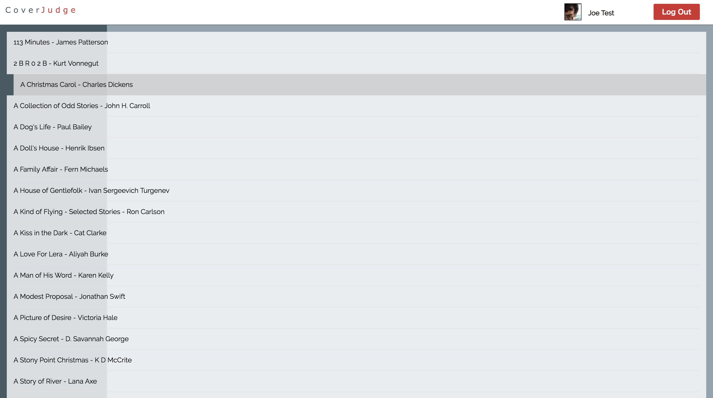
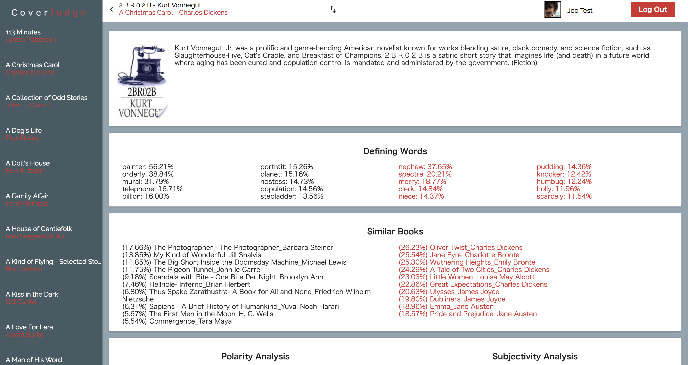
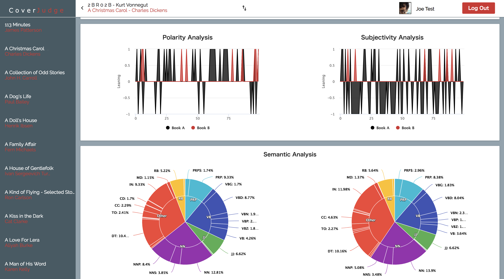

# Time At Last

## Purpose of the project.
The purpose of this project is evaluate the closeness of the writing composition between one book and a group of other books.

To do this I have broken down the steps into two parts in the code above.
  * parser.py
  * analyzer.py

#### Parser.py
Works with the content of each book. Every book that comes into the parser:
  * Has it's parts of speech and sentiment calculated.
  * Has it's stop words and proper nouns removed.
  * Remaining POS (Part of Speech) Tags, Words, and Sentiment is saved as raw json to be read by the analyzer.

#### Analyzer.py
Works with the content of each book in respect to every other book:
  * Look at the sentiment over time and mark period of book where it crossed certain thresholds.
  * Use TFIDF vectorization to compare common and unique words in all books and output most similar books.
  * Use cosine similarity to characterize defining words in each book that appear the least in the other books.

I have added an output of the text as well to this repo as results.txt.

### Demo
  A demo of this technique is below.
[Final product demo](https://gentle-waters-98866.herokuapp.com/)

